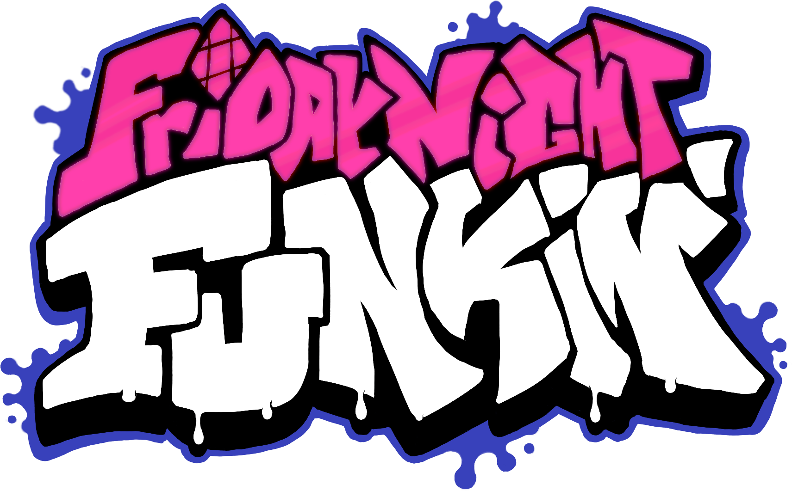
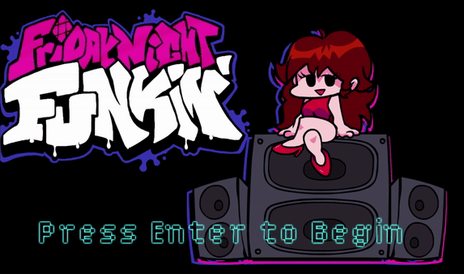
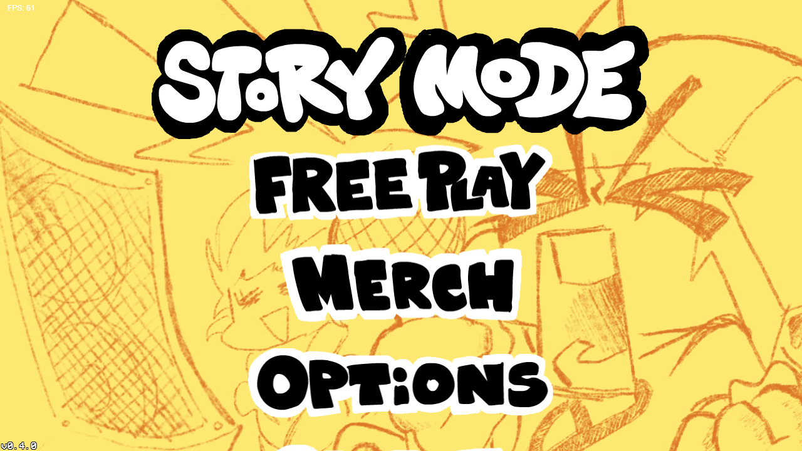

<div align='center'>

<h2>Friday Night Funkin' is a rhythm game. Built using HaxeFlixel for <a href="https://ldjam.com/events/ludum-dare/47">Ludum Dare 47.</a></h2>

This game was made with love to Newgrounds and its community. Extra love to Tom Fulp.

</div>

- [Playable web demo on Newgrounds!](https://www.newgrounds.com/portal/view/770371)
- [Demo download builds for Windows, Mac, and Linux from Itch.io!](https://ninja-muffin24.itch.io/funkin)
- [Download Android builds from Google Play!](https://play.google.com/store/apps/details?id=me.funkin.fnf)
- [Download iOS builds from the App Store!](https://apps.apple.com/app/id6740428530)

<div align='center'>
<table>
  <tr>
    <td></td>
    <td></td>
  </tr>
</table>
</div>


# VSlice Modchart Renderer

You can also call it NotITF

An avant-garde FNF Modchart System which is always WIP, never release

some modchart codes are from stepmania(90% maths) / mirin template(the default template to write mods) / Psych Engine(lua system)

Use lua_templete_mirin/mirin-fnf.lua to write mods, put the file into "assets/scripts/" or "mods/your-mod/scripts/" and rename it by song name

ZBuffer, ReceptorZBuffer, ArrowCull are 3D stuff, Flixel is a 2D engine, it doesn't have depth test, so I can't simulate those mods, all 3D effects you see in this tool are fake!


## MY SANDBOX

-- 1. Use other modchart stuff's functions

```lua
	-- avg4k style
	local function activateMod(name, beat, len, easestr, value)
		ease{beat,len,_G[easestr],value,name}
	end
	local function activateModMap(name, beat, len, easestr, value, dir)
		ease{beat,len,_G[easestr],value,name..dir}
	end

  -- trollengine/nightmarevision style
  local function queueSet(step,name,value,player)
    set{step/4,value/100,name,plr=player}
  end

  local function queueSetP(step,name,value,player)
    queueSet(step,name,value*100,player)
  end

  local function queueEase(step,endstep,name,value,ease,player,startval)
    local e
    if type(ease) == 'string' then
      e = _G[ease]
    elseif type(ease) == 'function' then
      e = ease
    else
      e = linear
    end
    if startval and type(startval) == 'number' then
      set{step/4,startval,name}
    end
    ease{step/4,endstep/4,e,value/100,name,plr=player,m='e'}
  end

  local function queueEaseP(step,endstep,name,value,ease,player,startval)
    queueEase(step,endstep,name,value*100,ease,player,startval)
  end

  local function queueFunc(step,endstep,callback)
    perframe{step/4,endstep/4,callback,mode='e'}
  end

  local function queueFuncOnce(step,callback)
    func_function{step/4,callback}
  end
```

-- 2. Make modifier yourself

```lua
local arrow_size = 112
moddata = {
	curve = {
		magnitude = 0,
		offset = 0,
		period = 0
	} -- example : bouncez
}
function GetXPos(col, yoff, xoff)
	return getPos(col, yoff, xoff).x
end
function GetYPos(col, yoff, xoff)
	return getPos(col, yoff, xoff).y
end
function GetZPos(col, yoff, xoff)
	return getPos(col, yoff, xoff).z
end
function GetScaleX(col, yoff)
	return getScale(col, yoff).x - 1
end
function GetScaleY(col, yoff)
	return getScale(col, yoff).y - 1
end
function GetScaleZ(col, yoff)
	return getScale(col, yoff).z - 1
end
function getPos(col, yoff, xoff)
	local pos = {x = 0, y = 0, z = 0}
  if moddata.curve.magnitude ~= 0 then
    pos.x = pos.x + math.abs(math.sin(((yoff + moddata.curve.offset) / (90 + (moddata.curve.period * 90))))) * moddata.curve.magnitude * 0.5 * arrow_size
  end
	return pos
end
function getScale(col, yoff)
	local scale = {x = 1, y = 1, z = 1}
	return scale
end

function initDefines()
	for name, mods in pairs(moddata) do
		for subname, value in pairs(mods) do
			local rs = subname
			if rs == 'magnitude' then
				rs = ''
			end
			definemod{name..rs,function(a)
				moddata[name][subname] = a
			end}
		end
	end
end

-- fnf mirin template's callback
function initMods()
  initDefines()

  -- now the modifiers have been registered, write modchart here
end
```

-- 3. Make transient effect

```lua
  -- ported from corruption mod, as an example
  local a = 1
	local function trigchaotic(t,typ)
		if typ == 0 then
			set{t,11.25*a,'confusionoffset',100,'bumpyperiod',75*a,'bumpy',-500*a,'tipsyz',100*a,'drunk',0.7,'xmod'}
			ease{t,1,outQuad,0,'confusionoffset',0,'bumpy',0,'tipsyz',0,'drunk',0.9,'xmod'}
		elseif typ == 1 then
			set{t,35*a,'confusionoffset',50*a,'bounce',200*a,'bumpy',100,'tipsy',150*a,'drunk',0.75,'xmod'}
			ease{t,1,outQuad,0,'confusionoffset',0,'bounce',0,'tipsy',0,'drunk',0.9,'xmod',0,'bumpy'}
		elseif typ == 2 then
			set{t,22.5*a,'confusionoffset',200,'zigzag',500,'tipsyz',300,'tipsy',30*a,'drunk',0.75,'xmod'}
			ease{t,1,outQuad,0,'confusionoffset',0,'zigzag',0,'tipsyz',0,'tipsy',0,'drunk',0.9,'xmod'}
		elseif typ == 3 then
			set{t,35*a,'confusionoffset',100,'boost',300,'tipsyz',30,'drunk',0.75,'xmod'}
			ease{t,1,outQuad,0,'confusionoffset',0,'boost',0,'tipsyz',0,'drunk',0.9,'xmod'}
		end
		a = a * -1
	end
```


# Getting Started

**PLEASE USE THE LINKS ABOVE IF YOU JUST WANT TO PLAY THE GAME**

To learn how to install the necessary dependencies and compile the game from source, please follow our [Compiling Guide](/docs/COMPILING.md).

# Contributing

Check out our [Contributing Guide](/docs/CONTRIBUTING.md) to learn how you can actively contribute to the development of Friday Night Funkin'!

# Modding

Feel free to start learning to mod the game by reading our [documentation](https://funkincrew.github.io/funkin-modding-docs/) and guide to modding.

# Credits and Special Thanks

Full credits can be found in-game, or in the `credits.json` file which is located [here](https://github.com/FunkinCrew/funkin.assets/blob/main/exclude/data/credits.json).

## Programming
- [ninjamuffin99](https://twitter.com/ninja_muffin99) - Lead Programmer
- [EliteMasterEric](https://twitter.com/EliteMasterEric) - Programmer
- [MtH](https://twitter.com/emmnyaa) - Charting and Additional Programming
- [GeoKureli](https://twitter.com/Geokureli/) - Additional Programming
- [ZackDroid](https://x.com/ZackDroidCoder) - Lead Mobile Programmer
- [MAJigsaw77](https://github.com/MAJigsaw77) - Mobile Programmer
- [Karim-Akra](https://x.com/KarimAkra_0) - Mobile Programmer
- [Sector_5](https://github.com/sector-a) - Mobile Programmer
- [Luckydog7](https://github.com/luckydog7) - Mobile Programmer
- Our contributors on GitHub

## Art / Animation / UI
- [PhantomArcade3K](https://twitter.com/phantomarcade3k) - Artist and Animator
- [Evilsk8r](https://twitter.com/evilsk8r) - Art
- [Moawling](https://twitter.com/moawko) - Week 6 Pixel Art
- [IvanAlmighty](https://twitter.com/IvanA1mighty) - Misc UI Design

## Music
- [Kawaisprite](https://twitter.com/kawaisprite) - Musician
- [BassetFilms](https://twitter.com/Bassetfilms) - Music for "Monster", Additional Character Design

## Special Thanks
- [Tom Fulp](https://twitter.com/tomfulp) - For being a great guy and for Newgrounds
- [JohnnyUtah](https://twitter.com/JohnnyUtahNG/) - Voice of Tankman
- [L0Litsmonica](https://twitter.com/L0Litsmonica) - Voice of Mommy Mearest
